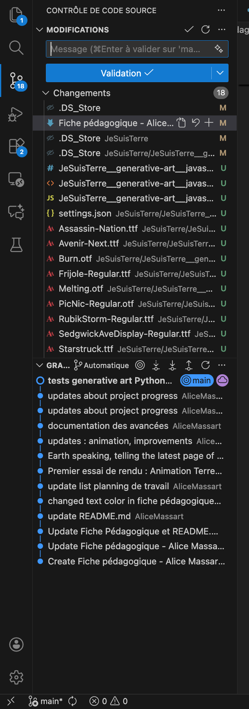

# Fiche Pédagogique

## Informations Étudiant

- **Nom :** Massart

- **Prénom :** Alice

  

## Profil et Connaissances

### Présentation Personnelle

//Décrivez en quelques phrases vos objectifs à court terme et long terme si vous en avez.

Mon objectif est de travailler dans le numérique au service/en me rapprochant des sciences. J’aimerais notamment intégrer le Master Design des Mines Nancy qui allie ingénieurs et designers dans un processus créatif commun, ou un master similaire.
Mon intérêt personnel pour l’aéronautique me donne vraiment envie de m’intégrer à ce domaine.

### Compétences

**CODE CRÉATIF**  
Je suis à l’aise en HTML, CSS et je commence à l’être avec JavaScript (je comprends le langage mais j'ai du mal à l'écrire). J’utilise aussi Python pour me créer des outils simples ou pour du code créatif.

[JeSuisTerre__generative-art](JeSuisTerre/JeSuisTerre__generative-art)  

J'ai fait du code créatif en python :
[JeSuisTerre__generative-art/python](JeSuisTerre/JeSuisTerre__generative-art/python)  
et en Javascript pour interagir avec un texte et le modifier en direct : [JeSuisTerre__generative-art/javascript](JeSuisTerre/JeSuisTerre__generative-art/javascript)

**GIT ET VERSIONNING**  
Je suis plutôt à l'aise avec les outils simples de GitHub notamment le github pages, les codespaces, github desktop et les commits.

**INTERACTIVITÉ ET RENDU TEMPS RÉEL**  
Les codes créatifs python et javascript analysent interagissent en temps réel avec le texte quotidien de l'IA.
Ils analysent les textes pour en tirer des mots clés.
Le code python transforme ces mots-clés en formes tandis que le code javascript modifie la typographie de ces mots.

**GRAPHISME ET DESIGN D'INTERFACE**

**INSTALLATION ET MISE EN ESPACE**

**PRÉSENTATION ET ARGUMENTATION**

## PROJETS

# Projet 1

### Sujet de Projet

- **Titre du projet :** Journal de bord - Terre
- **Description du projet (environ 150 mots) :**
Ce projet consiste à utiliser une intelligence artificielle pour personnifier la planète Terre et lui faire écrire un journal de bord. À partir d’actualités et d’informations sur le changement climatique, l’IA rédige des entrées à la première personne, exprimant ce que la Terre pourrait “ressentir”. L’objectif est de sensibiliser aux enjeux climatiques à travers une narration immersive et créative, en donnant une voix symbolique à la planète pour rendre l’information plus vivante et accessible.

### Thématiques de Recherche

- **Thématiques que vous souhaitez explorer :**
Sciences par le design, Actualité climatique
- **Pourquoi cette thématique vous intéresse-t-elle ? (environ 100 mots) :**
Elle permettrait de rendre compte de l’actualité climatique tout en abordant des notions scientifiques.

## Outils et Techniques

- **Outils que vous comptez utiliser (logiciels, langages de programmation, etc.) :**
API pour les données climatiques, IA textuelle programmée pour le projet, pour le rendu visuel : html css js ou python ou godot.
- **Techniques spécifiques que vous souhaitez maîtriser ou expérimenter :**
Programmation d’IA et récupération de données grâce à une API

## Références Artistiques

- **Argumentaire expliquant la pertinence de votre projet (environ 150 mots) :**   
- **Références artistiques qui inspirent votre travail (livres, artistes, œuvres, etc.)&nbsp;‡:**  
  - *Le Livre Infini*, Albertine MEUNIER (2016)  
  - *Sphere at The Venetian Resort Las Vegas*, 	Cabinet d'architecture Populous etSeverud Associates (2023)  
  - *ClimarisQ*, réalisé par Opal Games, conçu par Davide Faranda, proposé par LSCE – CNRS – CEA – IPSL – Université Paris Saclay – Universcience (2022)  
  - [Moodboard Pinterest](https://pin.it/43FP2UxdK)

## Actions

### Contribution à un Projet d'Autre Étudiant

// Décrivez comment vous comptez contribuer au projet d'un autre étudiant (proposition d'idées, aide technique, etc.)

#### 07/11 :

J'ai discuté avec Manon de son projet sur le 11 septembre 2001. Je lui ai recommandé l'utilisation de la VR dans son projet qui pourrait ajouter une immersion encore plus forte dans son projet.

J'ai discuté avec Ahafiia de son projet de musique live coding. Je lui ai donné la référence d'*Incredibox* qui m'a paru intéressante par rapport à son envie de mêler musique traditionnelle ukrainienne et musique électronique.

J'ai aidé Adèle à utiliser Github (les Codespaces et configurer Github Desktop).

Naya m'a donné des conseils sur l'esthétique de mes visuels. En cours de dessin, j'utilisais de la peinture, elle m'a donc conseillée d'essayer des tâches d'aquarelle au lieu des formes numériques bien dessinées.  
[Essai de rendu aquarelle](<documentation/Semaine du 24 novembre/vendredi 28 nov/journal-de-bord_generative-art_test-aquarelle.jpg>)

### Contributions aux ressources

Des ressources communes seront alimentées par tous. Chaque étudiant devra contribuer et enrichir cet ensemble de ressources.

## Planification

### Planning de Travail

- Établissez un planning des étapes clés pour votre projet :
  
  - **Étape 1 :**
  Entre le 7/11 et le 24/11 :
    - [X] définir les APIs utilisées
    - [X] le langage de programmation
    - ~~[ ] le prompt pour les test~~
    - [X] le premier prompt définitif.
    - [X] réfléchir à la mise en forme du journal de bord et du repository.
    - [ ] créer une base code pour y correspondre.
    - [ ] réfléchir au rendu et à l'argumentation du projet.
  
  - **Étape 2 :**
  Semaine du 24/11 :
    - [ ] programmer les APIs.
    - [ ] faire des tests et obtenir un résultat de page de journal de bord satisfaisant.
    - [ ] faire des tests avec plusieurs prompts différents.
  
  - **Étape 3 :**
  Semaine du 01/12 :
    - [ ] finir les derniers détails.
    - [ ] préparer le rendu et l'accrochage.

## Commentaires et Questions

//Avez-vous des questions ou des préoccupations à propos du cours ou de vos projets ?

Je ne sais pas du tout comment programmer une API IA et j'y pense beaucoup. J'ai à la fois très hâte d'apprendre et en même temps lorsque je me lance dans des tutoriels ou autre, je me rends compte que je ne comprends absolument rien... Je persévère 💪

# Journal de bord

### Du lundi 03 au jeudi 06 novembre :
- Réflexion sur les idées de projet et les objectifs.

### Vendredi 07 novembre :
- Définition du projet, des objectifs, des outils et du plan.
- Recherches et essais d'utilisation des API (Openai, Global Warming, OpenMeteo)

### Lundi 10 novembre :
- Complétion de la fiche pédagogique.
- Renseignement sur l'API Openai et son fonctionnement.

[Comment créer un chatbot avec l'API Openai non-sécurisée pour la production - partie 1](https://robinmoretti.eu/comment-creer-un-chatbot-avec-lapi-openai-non-securise-pour-la-production-part-1/)

Doc Openai :

- https://platform.openai.com/docs/overview

- https://platform.openai.com/docs/guides/text

- https://platform.openai.com/docs/guides/structured-outputs?example=structured-data

[OpenAI API Masterclass: Platform, Models & API Explained (Part 1/5)](https://www.youtube.com/watch?v=9ZyHckE3iIo)

[OpenAI Structured Output - All You Need to Know](https://www.youtube.com/watch?v=fuMKrKlaku4)

[Former votre propre modèle d'IA n'est pas aussi difficile que vous le pensez (probablement)](https://www.youtube.com/watch?v=fCUkvL0mbxI)

- Recherche de références et d'idées de rendu.

Idée de rendu :
Site Web avec une planète Terre en style dessin. Lorsque cliquée, elle raconte son ressenti du jour. Une petite flèche mène à une autre page qui elle représente le journal de bord comme un livre numérique.

### Du mardi 11 au vendredi 14 novembre :
Maquette Figma interactive du premier rendu web.  
Programmation d'un premier essai du rendu web.  
[Maquette Figma](documentation/maquette/JeSuisTerre_maquette_v1.fig)

### Dimanche 23 novembre :
- Renseignement sur l'API Openai et son fonctionnement.

Grâce à Perplexity.ai :
[Utiliser l'API Openai sur un ordinateur externe](<documentation/Semaine du 24 novembre/utiliser-api-openai-sur-un-ordinateur-externe.md>)
[Tutos intéressants pour configurer l'API Openai](<documentation/Semaine du 24 novembre/ tutos-intéressants-pour-configurer-api-openai.md>)

[OpenAI with Python: A Step-by-Step Guide for Beginners](https://www.youtube.com/watch?v=-A7njXsJl5M)

### Lundi 24 novembre :
- J'ai trouvé un lien intéressant pour mon rendu html : [How to make a page flipping book in HTML](https://fliphtml5.com/learning-center/fr/how-to-make-a-page-flipping-book-in-html/)

- J'ai tout repris depuis le début sur conseil de Robin. Je me suis installée au bureau pour le reste de la journée à chercher des références graphisque et faire des tests de rendu visuels.
[Moodboard Pinterest](<documentation/Semaine du 24 novembre/lundi 24 nov/MoodboardPinterest.mhtml>)

### Mardi 25 novembre :
- J'ai continué les recherches graphiques.
Essais avec un code python pour les formes.
Essais avec Javascript pour modifier directement le texte (changer la police des mots).
Je vais me renseigner sur Tkinter pour peut-être mêler les 2 ?
[Tutoriel Tkinter - interface graphique python](https://python.doctor/page-tkinter-interface-graphique-python-tutoriel)
